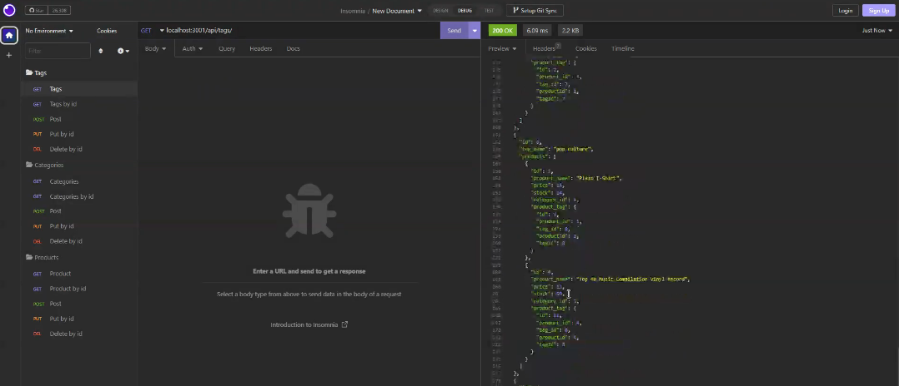

# E-Commerce ORM

## Description

This program uses MySQL to view relationships between products, their tags, and their categories.

## Installation
This program uses Express v4.17.1, MySQL2 v2.1.0, Sequelize v5.21.7, and dotenv v8.2.0. To install, copy and paste the following into your command line:

```sh
npm i
```

To run the program, first log into your MySQL and create the database. Then, copy and paste the following command into your command line. This will populate data into your tables so you can test the functionality of this program.

```sh
npm run seed
```

After, initialize the program by using the following command:

```sh
npm start
```

Then use a program to test your API ends (like Insomnia).

## Visuals
The following video shows an example of the application being used from Insomnia.

[](https://drive.google.com/file/d/1S3uAHxgXI2VtJkDD9IMHIRyLjSzFZ4nC/view)
